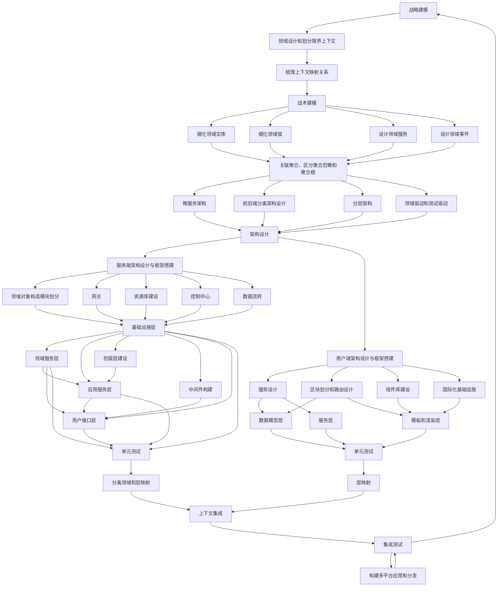

# Minellius

**一套实验性的 GITHUB 数据解决方案**

## 一. 项目概述

计划开发的 Minellius 是一套实验性的 GITHUB 数据解决方案，它将集数据收集、持久化、整合、分析、可视化、实时监控、趋势追踪及便利设施于一体，提供新型、全方位的服务。

Minellius 旨在帮助用户了解开源世界的历史、当下、潮流、沉浮兴衰，提升时代嗅觉和社区文化审美；调整开发者学习、自我提升的路径，以更好的融入、参与社区资源和文化的发展和建设。

初期的参与人员有：周烨恒 林锦涛 曹巍瀚 方安 崔天宇。

早期开发阶段为私有仓库，若项目成功、且待较为完善之后，将以 MIT 许可证公共发布。

## 二. 项目实施的应用背景

### 2.1 开源重塑世界

> 开源软件是一种源代码可以任意获取的计算机软件，这种软件的版权持有人在软件协议的规定之下保留一部分权利并允许用户学习、修改、增进提高这款软件的质量。开源协议通常匹配开放源代码的定义的要求。一些开源软件被发布到公有领域。开源软件常被公开和合作地开发。

开源改变了未来软件的开发模式，使得聚集大家的力量打破组织边界、持续创造出更高质量、更安全、更易用的软件成为可能，更重要的是改变了软件的使用方式――从“使用许可”为主的商业模式变成以支持、咨询等面向服务为主的商业模式，在全球向服务经济转型的过程中扮演着日益重要的角色。 

### 2.2 革命者、先行者和非凡使命 — GIT、GITHUB

在上世纪90年代，让 Linux 连同其它开源项目和 GNU 分离的重要因素就是前者的协作开发是大型的、去中心化的程序员。承接着这一原则，在 20 世纪初，Git 出现推动了开放源代码管理方式，它让开发过程前所未有的无限扩展，而且近乎允许让每一个人做贡献，这无疑是革命性的创举。

Git 将开源编码的开放性带到了更高的高度，可以让任何一个人非常快速的推出一个开源项目，通过 Web 无缝的接受他人的贡献！而率先实现后者并将其的概念拓展到一个新的层次的是 —— GitHub。

在短短的10年里，GitHub 改变了人们的编程方式。不仅让编程变得更简单，还改变了软件开发者对编程的看法。GitHub找到了全世界数百万人正在努力解决的一个大问题——如何在代码上协作——并设计出了市场急需的、优雅的解决方案，实现了令人难以置信的增长和成功。从某种程度上说：

> “它是共产主义在软件开发领域的具体实现样板之一，即以生产资料社会公有制为基础（代码开源），以社会化合作（离散化的个人、组织等社会颗粒）为主要生产方式，主要采用合作社组织形式（项目组）的技术支撑平台。”

### 2.3 数据的时代

> 数据，已经渗透到当今每一个行业和业务职能领域，成为重要的生产因素。人们对于海量数据的挖掘和运用，预示着新一波生产率增长和消费者盈余浪潮的到来。

随之而来的数据仓库、数据安全、数据分析、数据挖掘等等围绕大数据的价值的利用逐渐成为人们争相追逐的焦点。随着大数据时代的来临，大数据分析也应运而生。

## 三. 项目实施的迫切性

### 3.1 数据价值高、用户群体大、与用户关系紧密

GitHub 上到已包含多达 337 种编程语言，2400 万用户，百万以上的项目数。几乎大部分知名的开源项目都已经进驻该平台。

其数据包括仓库和用户数据等种类的数据，可以反映程序语言、框架、库、架构、知识体系、设计风格、管理技术、地区分布、时序数据、国家分布、性别情况、社会状况等，对个人学习、研究、技术社交、商业参考、职业招聘等极高的价值。

对于大多数开发者，该平台已经成为了工作和生活中不可缺少的一环，都有对全球的开发者来说随时关注其数据和数据反映的动向是十分必要的。

### 3.2 新手学习曲线陡峭，缺乏客观引导，学习资料陈旧、鱼龙混杂

新入行的开发者面对急速发展的业界，面对浩如烟海、鱼龙混杂的资料，如果又缺乏客观有效地引导，往往会感觉到无所适从，学习曲线十分陡峭。

而通过 GITHUB 数据分析出的结果，往往能帮助这些开发者取精去糟、砂里淘金，明确学习的方向和手段；又避免了由他人主观看法引导可能产生的偏见、误导和别有用心。

### 3.3 领域蓝海，竞争少、探索和成长空间大 

据前期调查，当前尚且没有和本项目计划定位的“生态位”重复度高的知名项目、该领域还是一片蓝海，竞争很少，有探索的价值；随着项目的发展，可能得出很多有意思的结论，甚至形成新的方法论、开发出更多的需求 …… 项目后期的成长空间比较大。

### 3.4 需求大，但缺乏完整的解决方案

当下，github 数据往往成为业界很多项目的启动依据、开发者话题讨论、学习、就业的依据，但是各大榜单、包括 github 官方提供的 trends 、年度榜单，都是领域很窄、时间粒度极粗的不完整解决方案。这些需求亟待一个完整的解决方案来满足。

### 3.5 国内整体相对积累不足，技术落后，视野局限

作为技术的后发和经济的发展中国家，我国计算机和软件学术、产业、工程等各个环节的发展程度低、技术和学术积累不足。

与前者互为因果的是，相关产业和其人员视野相对局限，经常出现国际趋势和技术流行的若干年后才在我国推开、并且某些淘汰的技术被某些因循守旧、故步自封的相关人员奉为圭臬。

通过对 GITHUB 的数据可以有效的获取全球项目、用户的信息，对国内业界可以说是一份很有意义的参考意义的技术趋势。

### 3.6 国内开发者开源精神孱弱，缺乏参与意识和使命感，少有业界话语权

国内对技术不够重视、有“转管理”的思维惯性；为数不少的开发者缺乏对专业的热情，全为生计和经济利益；开源精神孱弱，缺乏相关项目的参与意识，缺乏对社区回馈的精神，缺乏带动进步的使命感，贡献相对较低、业界话语权较小。

该项目可以帮助开发者了解开源精神、社区文化，培养参与感和使命感，乃至发现有潜力的项目作出自己的贡献。

### 3.7 怀揣理想开发者的锻炼提升、社会责任、自我实现

通过本项目，项目组的能力可以得到相当程度的提升；成功实现后若开源并发挥一定的效用，将是对社区的回馈，承担了应有的社会责任，是怀揣理想的开发者推动业界乃至世界前进的自我实现的需要。

## 四. 项目需要完成的功能

### 4.1 海量数据的采集、持久化、预处理

#### 4.1.1 必要功能：

1. 数据的采集
2. 数据的本地存储

#### 4.1.2 可能相关的基础系统：

1. 爬虫系统
2. 数据库系统

#### 4.1.3 计划中可能的拓展功能：

1. 丰富的预处理手段
2. 高度自动化的高吞吐流式数据处理
3. 监控和告警系统
4. 细粒度的时间控制
5. 依靠现有平台的云数据处理

### 4.2 多维度的数据的挖掘、分析，结果的生成

#### 4.2.1 必要功能

1. 数据分析算法和组件
2. 报表生成器

#### 4.2.2 可能相关的基础系统

1. 数据库系统
2. 数据分析系统
3. 报表生成系统

#### 4.2.3 计划中可能的拓展功能

1. 多种机器学习方法的使用
2. 更多多维度的数据分析
3. 针对用户定制化的体验

### 4.3 优秀的美术设计、用户交互和可视化

#### 4.3.1 必要功能

1. 基本的用户界面和交互
2. 报表的显示
3. 数据的可视化

#### 4.3.2 可能相关的系统

1. 前端渲染系统
2. 报表渲染系统
3. 数据可视化系统

#### 4.3.3 计划中可能的拓展功能

1. 优秀的美术设计
2. 方便易用、充分合理的用户交互
3. 高可控性的报表
4. 多维度、美观、动态可交互的数据可视化

### 4.4 用户系统、控制中心与反馈系统

#### 4.4.1 必要功能：

用户的登录功能

#### 4.4.2 可能相关的基础系统：

1. 用户系统
2. 权限系统
3. 安全系统

#### 4.4.3 计划中可能的拓展功能:

1. 更加多样化的用户登录: 如人脸识别验证、验证码。
2. 更加丰富的用户注册验证：邮箱、短信等。
3. 更加安全的用户信息传输：HTTPS、HSTS、TLS1.3等。
2. 可交互的控制中心。
3. 反馈系统。

### 4.5 优雅、可拓展的系统服务框架

### 4.6 跨平台的应用实现

#### 4.6.1 可能相关的系统

1. 前后端分离的系统架构设计
2. 现代 WEB 应用框架和库

#### 4.6.2 计划中可能的拓展功能：

1. 发行 Windows、Linux、（如果能借到 macos 设备）MAC 跨平台桌面应用。
2. 时间充足情况下，界面自适应的 Web 版。
3. 时间充分充足情况下，安卓和 IOS 版。

### 4.7 原生的国际化

#### 4.7.1 可能相关的系统

国际化系统

#### 4.7.2 计划中可能的拓展功能：

应用本体的国际化，根据不同系统环境安装不同语言版本。

### 4.8 更多设计中的功能

## 五. 项目的人员安排

### 5.1 人员分工

- 周烨恒：战略建模、架构设计、框架搭建；客户端美术设计、模板渲染；实用工具、基础设施建设；服务端领域服务层、中间件建设；质量管理等。

- 林锦涛：数据模型设计、战术建模；客户端 UI/UX、数据可视化；服务端用户接口层构建；前后端联调；集成测试等。

- 曹巍瀚：算法设计、战术建模；服务端应用服务层，防腐层构建；持续集成，部署维护等

- 崔天宇 数据获取；数据预处理；数据持久化；基础服务层构建；战术建模等

- 方安：数据模型设计；客户端国际化工作；前后端联调；文档编写、产品运营；集成测试等。

### 5.2 备注：关于共有的工作

- 单元测试：单元测试由单元开发者进行，一段时间进行批量测试质量检查。

- 代码审查：每次主分支合并必须由 Pull Request 方式进行，需要一位熟悉该领域的开发者的代码审查；定期集体审查重点代码。

- 创意：每位开发者都有提出创意、建议的权利和义务。

## 六. 项目的进度计划

### 6.1 迭代的敏捷过程模型

#### 6.1.1 概要

项目采用迭代式的敏捷过程模型，但不同的是在首次迭代之前为达成总体架构设计和领域驱动目标，基础设施和框架搭建工作会导致首次迭代时间相对较长。

#### 6.1.2 迭代内容：

1. 策划：策划始于倾听，这是一个收集需求的过程。该活动要使工程人员理解软件的背景，感受要求实现的主要功能。这一部分本来是软件工程师与客户的充分讨论，然而本工程软件工程师即是客户，故该部分由组内成员一同讨论，决定如何将故事分组并置于团队将要开发的下一个软件增量中。一旦认可对下一个版本的基本承诺，团队将优先实现具有最高价值的故事，高风险的故事较早执行。

2. 设计：严格遵循保持简洁原则，即使用简单的设计，而不是复杂的表述。另外，设计为故事提供恰好可实现的指导，而不鼓励额外功能性设计。一旦在某个故事的设计中碰到困难，立即建立这部分设计的可执行原型。以便在真正实现开始时就降低风险，对可能存在设计问题的故事确认其最初的估计。

3. 编码：在故事开发和初步设计完成后，团队并不是直接开始编码，而是开发一系列测试单元用于检测本次软件增量发布。不需要加任何额外的东西。一旦编码完成，就可以立即完成单测试。

4. 测试：使用一个可以自动实施的框架建立测试单元，以支持每当代码修改后计实的回归测试策略。随后将个人的单元测试组织到一个“通用测试集”，每天都可以进行系统的集成和确认测试。也就是集成测试。这可以方便团队对下一阶段进行展望，也可在一旦发生问题的时候及早提出预警。

### 6.2 迭代流程图与时间安排

#### 6.2.1 时间安排

下一小节的流程图按照时间比例设计，其中除 “层” 节点作为特殊节点，所需的时间片与同时实现的功能数、难度成相关关系之外，其他节点的所需的时间片是每次迭代时间/节点层级数；具体参考下图。迭代次数视项目所有时间，短则 3 次、长则 5 次。

#### 6.2.2 迭代流程图

## 七. 项目的验收指标

### 7.1 项目交付项
编号 | 交付项 | 描述 |
---------- | ---------- |-----------|
1 | 程序 | 包括软件的安装程序与软件源代码
2 | 支持文件与环境说明、清单 | 第三方库、第三方插件以及必要的开发包和环境配置 
3 | 文档 | 软件的说明文档，包括主要功能实现以及代码的说明(备注)等
4 | 报告 | 包括报告与演示PPT

### 7.2 软件质量的基本度量

#### 7.2.1 课件要求的基本项目功能点

|    功能点  |    描述   | 备注
| ---------- |-----------|--------
| 爬取数据| 包括 Github 一定时间段内可爬取活动的数据 |基本信息包括用户信息、仓库信息等
| 账户登陆 | 实现账户的注册/登录 | 注册时应实现至少一种验证码
| 报表功能 | 实现美观，便于使用、理解的报表 | 
| 数据可视化 | 通过各种手段、各种形式实现数据可视化 | 用户可选择展示的内容 
| 项目报告与答辩 | 制作报告与项目的展示 

#### 7.2.2 软件测试指标

1. 较高的单元测试比率
2. 基本的集成测试
3. 基本的代码审查
4. 基本的安全性

### 7.3 软件质量的高级度量

#### 7.3.1 项目启动报告期望的功能点

- 海量数据的采集、持久化、预处理

- 多维度的数据的挖掘、分析，结果报表的生成

- 优秀的美术设计、用户交互和可视化

- 用户系统、控制中心与反馈系统

- 优雅、可拓展的系统服务框架

- 跨平台的应用实现

- 原生的国际化

- 更多实现的高级功能（如自动化部署运维等）

#### 7.3.2 软件测试指标

1. 完善的单元测试
2. 自动和人工结合的集成测试
3. 完善的代码审查
4. 较高的安全性（例如用户系统升级到jwt、TLS1.3等）
5. 较高的代码覆盖率
